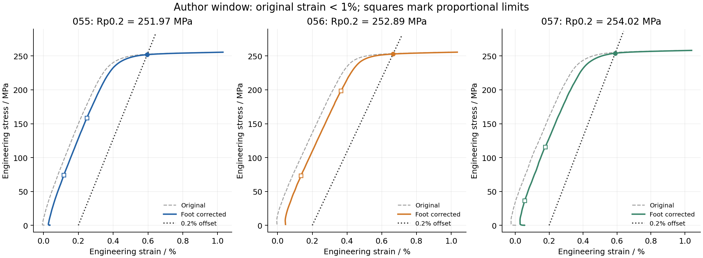

# Three public tensile specimens: CSV to inspectable results

[简体中文](README.md) | English

This example processes three uniaxial AA6061-T651 specimens from **lot A at 20 C**. The source distribution includes three attributed CC BY 4.0 engineering stress-strain curves, totaling 1,889 rows. No additional data download, model training or Abaqus run is needed.

One run computes UTS, elastic modulus and 0.2% proof stress using the author's method, normalizes the original input through the installed public pipeline, reads HDF5 back and repeats the calculation to check whether the transfer changes results.

## Install and run

Use **Python 3.12** and a separate environment for this fixed example. After obtaining the project's v0.3.1 source, run from the directory containing `pyproject.toml`:

```text
python -m venv .venv
```

Windows PowerShell:

```powershell
.\.venv\Scripts\python.exe -m pip install . -r examples/paramaterial_tensile/requirements.txt
.\.venv\Scripts\python.exe -B examples/paramaterial_tensile/workflow.py --run-dir runs/paramaterial-001
```

Linux/macOS shell syntax:

```bash
.venv/bin/python -m pip install . -r examples/paramaterial_tensile/requirements.txt
.venv/bin/python -B examples/paramaterial_tensile/workflow.py --run-dir runs/paramaterial-001
```

Windows and Linux are the release-validation platforms; a complete macOS run has not been verified. An installed wheel can also be used with the example directory from the source distribution. The entry point does not inject the checkout's `src/` into module lookup. `run.json` records the loaded public package version and location.

Choose a new `--run-dir` for each run. Existing directories are rejected and source CSV files remain unchanged. Example dependencies live in [requirements.txt](requirements.txt), separate from the base library dependencies.

## Outputs

| Output | Contents |
|---|---|
| `metrics.csv` | UTS, E, Rp0.2 and processing-window details for each specimen |
| `metrics_comparison.csv` | Direct CSV, HDF5-readback and independent-recalculation comparison |
| `curves.png`, `proof_stress.png` | Original/shifted full curves and small-strain proof construction |
| `curves/` | Per-row original and corrected curves with source row numbers |
| `normalized/` | Three canonical HDF5 samples and receipts |
| `verify_readback.json`, `run.json` | Separate-process readback checks and execution status |

Runtime receipts record the user's local file locations for traceability. Inspect those paths before sharing a generated run directory.

Reference calculations for the fixed inputs:

| Specimen | Original rows | UTS / MPa | E / GPa | Rp0.2 / MPa |
|---|---:|---:|---:|---:|
| 055 | 614 | 277.081 | 63.703 | 251.966 |
| 056 | 645 | 277.834 | 54.345 | 252.887 |
| 057 | 630 | 280.209 | 65.257 | 254.024 |

These are this project's independent recalculations, not recovered author per-specimen truth. Display precision does not imply experimental measurement precision.

[Example output](results/README.md) generated with the installed public package
is included for inspection before rerunning:



## Method

Use unmodified Paramaterial **0.1.0** and verify its processing-module SHA-256. Compute UTS from the full curve, retain **original strain `< 0.01`**, select proportional-limit points using the author's 36 MPa preload rule, obtain E from the endpoint secant, shift the strain origin, and interpolate the 0.2% offset intersection with the original function. All three specimens reuse the author's recorded non-rejection screening decisions.

HDF5 contains original, unshifted input. The origin correction is a downstream derivative. No smoothing, reordering or true-stress conversion is performed. Full-curve display applies the same shift; E and proof still use the author's small-strain window.

This checks transfer and calculation consistency, not material calibration, cross-material prediction or standards compliance. The original publication's 20 C reference table pools multiple lots and is not a per-specimen acceptance target for these three lot-A samples.

## Usability context

An earlier local independent-agent trial completed the author Notebook route and a rerun entry once each, with identical nine metrics. It supports independent use of a configured case. That trial preceded this public port: it is not a timing test of this release and establishes no human time-saving percentage. Both routes can start in one action. This entry consolidates outputs and automatically includes source, unit and readback checks.

## Sources and licenses

[SOURCES.md](SOURCES.md) records the dataset, pinned upstream commit, specimen mapping, hashes, screening evidence and transformations. Data and derived materials retain CC BY 4.0. Paramaterial and example MIT notices are in [licenses/](licenses/). Software licensing does not replace data licensing. The original paper full text, complete upstream Notebook, personal activity logs and machine environment are not distributed with this example.
